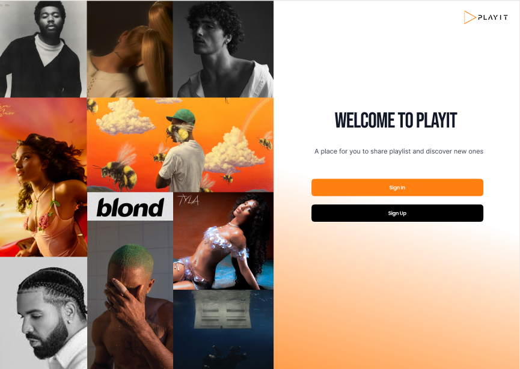

# PlayIt

# Playlist Sharing Web App

## Description
A web application that allows users to share and discover playlists. Built with React.

# Build the Docker image
docker build -t myapp .

# Run the Docker container
docker run -p 3000:3000 my-app